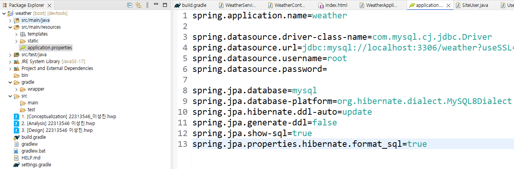

1. git clone을 할 로컬 저장소 새 폴더를 만든다.
2. 새로 만든 폴더에 https://github.com/SeongJiness/Weather로 들어가서 clone을 한다.
3. https://spring.io/tools 사이트에 들어가서 Spring Tools for Eclipse를 다운 받는데 운영체제에 맞는 걸로 다운로드한다.
4. https://www.apachefriends.org/ 사이트에 들어가서 xampp를 다운받는다. 자세한 다운로드 방법은 이 사이트를 참고한다. https://angelpsyche.tistory.com/48
5. https://github.com/webyog/sqlyog-community/wiki/Downloads 해당 사이트에 들어가서 SQLyog Community Edition - 13.3.0 (64-Bit)를 다운로드 한다.
6. xampp 패널을 열어서 MySQL를 Start시킨다.
7. SQLyog를 실행한다.
   왼쪽 상단의 하단 그림처럼 보이는 아이콘을 클릭한다.
     

   그 다음에 그림처럼 입력요소를 입력후에 연결버튼을 누르면 연결이 된다.  
   단 기존의 mysql에 root 비밀번호를 따로 설정한게 있다면 빈 공백이 아니라 따로 입력해야한다.  
   
   만약 비밀번호가 달랐다면 위에 사진에 "spring.datasource.password=" 에 설정한 비밀번호를 넣어야한다.

   8. 사진 처럼 root에 우클릭으로 weather 데이터베이스를 생성한다.

9. 다운받은 이클립스를 열어서 workspace를 clone으로 받은 폴더로 지정한다.

10. 이클립스가 열리면 build.gradle을 찾아서 우클릭후 Gradle아래에 그림처럼 Refresh Gradle Project를 누른다. , 그러면 오른쪽 아래에 무언가 다운로드를 받을 텐데 다 다운로드가 될 때 까지 기다린다.

   11. 왼쪽 아래에 weather을 우클릭 하고 start시킨다.   12. 오류가 뜨지 않고 잘 돌아 간다면 크롬 브라우저를 실행한다.  13. 크롬에서 http://localhost:8080/을 검색한다. 그러면 구현한 웹사이트가 잘 보일 것이다.

 
혹시나 자바 17버전이상이 아닐경우 https://wikidocs.net/160048을 참고해서 jdk를 다운받아야한다.

Readme.txt가 아니라 Readme.md으로 작성했습니다. 이미지를 이용해서 설명할 것이 있기 때문입니다.
